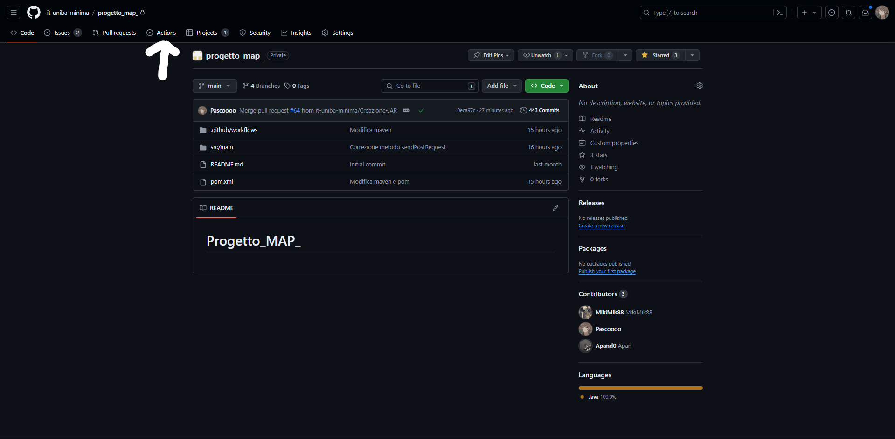
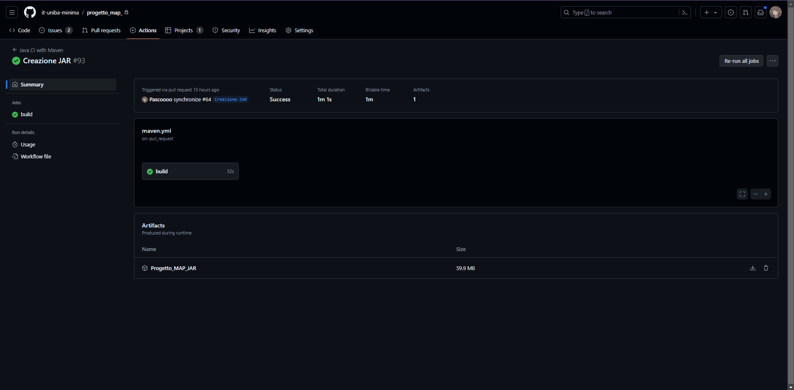
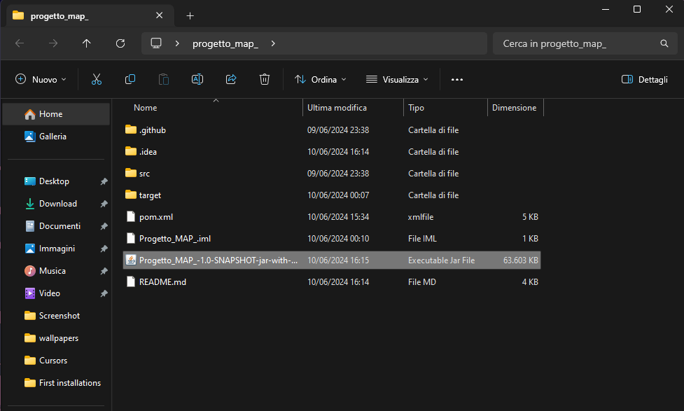

# Progetto MAP 


## Benvenuti nella guida all'installazione del gruppo Minima!


## Requisiti
<hr><br>
Per poter eseguire il nostro progetto è necessario:

- **Java 22**: per poter eseguire il nostro progetto è necessario avere installato Java 22.<br>
Per controllare la versione di Java installata sul proprio computer è possibile eseguire il comando `java -version` da terminale.
Nel caso in cui non fosse installato è possibile scaricarlo dal sito ufficiale di [Oracle](https://www.oracle.com/it/java/technologies/downloads/).<br>
Appena aperto il link, vi si presenterà la seguente schermata:


A questo punto sarete già sulla sezione della JDK 22, quindi non dovrete fare altro che cliccare sulla sezione del sistema operativo che state utilizzando e scaricare il file eseguibile.

- **Qualsiasi IDE che supporti Java o terminale**: per poter eseguire il nostro progetto è necessario avere un IDE o un terminale.<br>

## Come eseguire il progetto
<hr><br>
Per poter eseguire il nostro progetto ci sono due strade possibili:

- **JAR**: scaricare il file `Progetto_MAP_JAR.jar`.
- **Codice sorgente**: scaricare la cartella `Progetto_MAP` e importarla in un IDE.

In questo README verranno spiegate entrambe le strade.

### Operazioni obbligatorie
<hr><br>

Come già detto, il primo passo è scaricare il file `Progetto_MAP_JAR.jar` nel seguente modo:

- Il progetto utilizza come framework di gestione delle dipendenze Maven, quindi è possibile scaricare il file JAR direttamente dal repository GitHub del progetto.<br>
Dal momento che il progetto utilizza il framework Maven, la gestione del JAR è stata gestita automaticamente usando il `pom.xml` con i suoi plugin e l'utilizzo delle `GitHub Actions`.<br>
Quindi per scaricare il JAR è sufficiente andare nella sezione `Actions` del repository GitHub del progetto e scaricare l'ultima build eseguita, in questo modo:
- Andare nella sezione `Actions` del repository GitHub del progetto.


- Nella sezione `All Workflows` cliccare sulla  `Build` più recente, in questo caso `Creazione JAR`.


- A questo punto il gioco è fatto, basta vedere la sezione `Artifacts` e cliccare sul file `Progetto_MAP_JAR.jar` per scaricarlo.


- Nella sezione `Downloads` vi sarà apparso il download del file JAR in un file zip, che dovrete semplicemente spostare sul vostro desktop e spostare il file JAR all'interno della `cartella del progetto`, in questo modo:



### Esecuzione del JAR tramite terminale

Per eseguire il JAR è necessario aprire il terminale e posizionarsi nella cartella del progetto, dopodiché eseguire il seguente comando: 
    
    ```shell
    java -jar Progetto_MAP_JAR.jar
    ```

E' ovviamente possibile eseguire il JAR anche tramite un doppio click sul file, ricordandosi ovviamente di posizionare il file JAR nella cartella del progetto, come spiegato precedentemente.

### Esecuzione del JAR tramite IDE

Per eseguire il JAR tramite IDE è necessario aprire il progetto in un IDE, come ad esempio IntelliJ IDEA, Eclipse, NetBeans, ecc.<br>

Una volta aperto l'IDE, è possibile eseguire il JAR cliccando sul file JAR e selezionando l'opzione `Run` o `Esegui`, oppure è banalmente possibile runnare l'entrypoint del progetto, ossia la classe `Main.java`, nella cartella `src/main/java/org/it/uniba/minima`.


